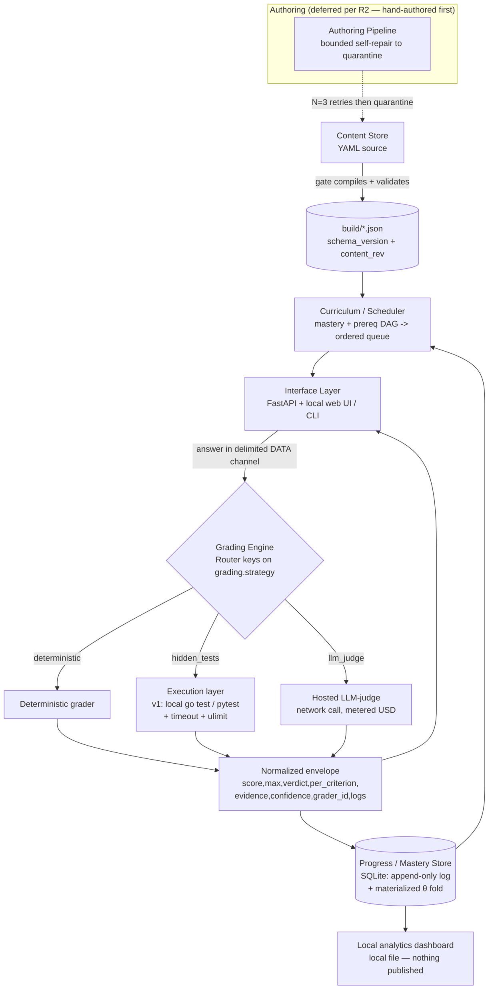

# 03 — Architecture

This doc names Crucible's components, their responsibilities, and the data flow between them, and fixes the concrete stack. It is the structural contract; grading internals live in [`04-grading.md`](04-grading.md), the content schema in [`05-content-model.md`](05-content-model.md), and the mastery arithmetic in [`06-progress-model.md`](06-progress-model.md). Feature scope and P0/P1/P2 priority live in [`02-features.md`](02-features.md).

## Stance: an orchestrator, not a replacement grader

Crucible is a **thin orchestrator layered over external labs** — not a new autograder. MIT **6.824**, **Jepsen Maelstrom / Fly.io Gossip Glomers**, and **CodeCrafters** already grade build-a-primitive and distributed-conformance work more rigorously than a hand-rolled sandbox will, and the research is explicit that a home-grown harness tends to crowd out the actual studying. So Crucible delegates *code and distributed conformance* to those labs and owns only what they lack: the **design-defense LLM-judge on his own repos**, **spacing/interleaving**, **mastery/θ tracking**, and the **"name the rejected alternative + failure mode + a number"** rubric. We hand-roll a grader only where no external one exists (short-answer, predict-output, design essays, explain-backs).

*Rejected alternative — a full first-party grading platform for every domain.* It duplicates 6.824/Maelstrom/CodeCrafters where they already win, concentrates the hardest engineering (a hardened sandbox, a fault-injection checker) exactly where an off-the-shelf tool is better, and leaves the differentiated part — design judgment on his own code — thin. The failure mode is a six-month infra project that teaches nothing; the mitigation is to reuse conformance graders and spend the saved effort on content volume.

## Stack

| Axis | Choice | Rejected alternative + why |
|---|---|---|
| Engine language | **Python 3.11** | Go — his first vertical slice *content* is Go, but the *engine* wants his deepest language so the tool ships fast; the content is the real project, not the runtime. |
| API / backend | **FastAPI** | A CLI-only tool — fine for the earliest slices, but a local web UI is the target and FastAPI + SSE is the seam he already owns. |
| State store | **SQLite** (append-only log + materialized fold) | Postgres — a server process and network dependency for a single-user, single-machine tool that never needs concurrent writers; SQLite is the file-on-disk that `recompute_from_log()` replays. |
| Frontend | **Lightweight local web UI** (hand-rolled light/dark) | An Electron shell — heavier than warranted; a browser tab against `localhost` is enough, and the analytics dashboard is a plain local file. |

Everything except the design-judge is genuinely local and offline. **The judge is not** (see below).

## Data-flow diagram



The spine is one direction: **authored YAML → compiled JSON → scheduled queue → attempt → router → exactly one grader → one envelope → mastery update → next queue**. Nothing hand-edits the compiled JSON (the gate compiles it, closing a drift hole), and every grade lands as the same envelope shape regardless of which grader produced it.

## Components

### Content Store

One YAML file per lesson under `content/<track>/<id>.yaml` co-locating teach blocks, worked examples, assessments, per-assessment rubric, reference answer/solution, and hidden tests. The gate compiles each to `build/<id>.json` for the runtime. It owns `schema_version` (the gate refuses unknown or newer versions) and a per-lesson `content_rev` bumped on any edit; **git is the version store**.

*Rejected alternatives — a content database* (opaque, un-diffable, un-reviewable in a PR) *and Markdown-with-front-matter* (cannot express the executable grading spine — reference solutions, hidden tests, rubric criteria). YAML source is chosen over raw JSON because his own `AUTHORING.md` flags JSON-escaping of embedded code as a pain point; block scalars carry code cleanly. JSON as the *runtime* form keeps a fast, formal schema gate. The trade is deliberate: author in YAML, gate in JSON.

### Curriculum / Scheduler

Turns mastery state + a prereq DAG into an **ordered session queue**. It assembles a candidate pool of `due ∪ weak (θ < goal) ∪ prereq-cleared-new`, ranks by `w_due·overdue + w_weak·weakness + w_new·newness + w_desirable·(target E≈0.85)`, caps new items (default 1/session), and forbids more than two consecutive same-domain items so the learner practices *selecting* the primitive, not grinding one topic. It reads θ / `due_at` / `half_life` from the Mastery Store and prereq edges + item difficulty `b` from the Content Store; it writes nothing.

*Rejected alternatives — fixed-calendar review* (ignores mastery) *and blocking one topic to completion* (worse discrimination and transfer than interleaving). Full detail, including the R9 gate-vs-θ distinction, is in [`06-progress-model.md`](06-progress-model.md).

### Grading Engine (router + three strategies)

A **Router keys on `grading.strategy`, not on question type**, so there are exactly **three** code paths — `deterministic`, `hidden_tests`, `llm_judge` — no matter how many question types the taxonomy grows to. Each grader returns **one normalized envelope**:

```
{ score, max, verdict, per_criterion[], evidence[], confidence, grader_id, logs }
```

Composite items (code + design prose) combine sub-scores with the **deterministic verdict as a hard gate**: the judge may only lower or flag, never raise, a test verdict (Correctness > everything else). The discriminated-union design mirrors his `StorageEngine` / `Source`-adapter seam habit — adding a fourth strategy never touches the router.

*Rejected alternative — routing on question type*, which would fan out to a dozen near-duplicate paths and re-couple the router to the taxonomy every time a question type is added. Routing tables, trust safeguards, and cost/latency budgets are in [`04-grading.md`](04-grading.md).

### Execution layer (R3 — descoped for v1)

**v1 runs learner code with plain local `go test` / `pytest` + a wall-clock timeout + a resource `ulimit`.** This is *his own code on his own machine* — the RCE threat is near-zero — so the hardened container (rootless + seccomp + gVisor + cgroups) is **deferred behind a swappable runner seam**, promoted only when AI-authored or shared content actually exists.

*Rejected alternative — building the security cathedral first.* It front-loads the single hardest component against a threat that does not exist until Phase 5+, putting weeks of isolation engineering on the critical path to the first learning value. When the hardened runner *is* built, two problems must be solved before it works, and they are first-class, not footnotes: the **Go no-network module-cache** problem (pre-baked `GOMODCACHE`, `GOFLAGS=-mod=vendor`, `GOPROXY=off`, or `go test` fails fetching modules) and **panic/compile-error source-leak scrubbing** (Go prints `file:line` and a compile error in a hidden-test file dumps its source). Because it is a seam, v1's plain runner and a future container implement the same interface — swapping one for the other never touches the router or the envelope.

One soundness caveat carried from R4: the `predict_race_verdict` item is **probabilistic, not a clean oracle**. `go test -race` has false negatives (it only reports interleavings it observes) and Go randomizes map iteration order, so the verdict is run over many iterations and reported as such — see [`04-grading.md`](04-grading.md).

### Progress / Mastery Store

**SQLite.** The **append-only attempt log is the source of truth** (per-attempt before/after snapshots of θ, `b`, `half_life`). `skill.theta`, `half_life_days`, and `due_at` are a **materialized fold** over that log; a config table holds every tunable. `recompute_from_log()` **replays the scheduler arithmetic from the stored grades** — it does *not* re-grade — so retuning a scheduler constant (K, half-life, weights) is a deterministic replay, not a migration.

*Rejected alternative — mutable current-state rows.* They cannot be re-derived after a constant changes, turning every retune into a lossy migration. The event-sourced log is directly testable and matches his verification taste. **Limitation (R9):** bit-for-bit replay reproduces θ from *stored* grades only; retuning a rubric or swapping the judge model **invalidates those grades and needs a fresh, non-free, non-deterministic re-grade pass** — "bit-for-bit" is a property of the scheduler fold, not of grading.

### Authoring Pipeline (deferred per R2)

Converts a note/topic into a gate-passing lesson via a **bounded self-repair loop**: LLM skeleton → structural preflight (no LLM) → executable materialization (run every reference in the sandbox) → rubric self-consistency → advisory adversarial audit → merge only green. Bounded to **N=3 retries then quarantine** to a review queue — it never hard-fails the batch (graceful degradation with a surfaced reason).

This is **deferred, not P0.** The R2 sequence leads with a **content-first pilot**: hand-author 10–15 real Go lessons tied to `conclave`, grade with plain `go test`, and use it daily for 2+ weeks to prove learning value *before* the authoring machinery is earned. *Rejected alternative — building the AI pipeline before proving daily use*, which risks a slick generator feeding a workbook nobody opens.

### Interface Layer

A **FastAPI backend + a lightweight local web UI** is the target; a **CLI session-runner serves the earliest slices** (fastest path to a working vertical slice, and his daily driver). It renders teach blocks, captures answers, drives the grading engine, and surfaces feedback (reveal-on-miss, minimal failing input on a hidden-test fail, per-criterion breakdown with evidence + confidence for judge items). Learner text flows to the grader in a **delimited data channel**, never concatenated into judge instructions (blocks prompt injection through the answer). A **local-file analytics dashboard** renders the mastery heatmap σ(θ), a calibration reliability plot + Brier score, and latency p50/p90/p99 — **written locally, nothing published to claude.ai** per his standing rule.

*Rejected alternative — a GUI-first shell before any grader works*; the CLI reaches an end-to-end slice sooner and defers the UI to when there is something to render.

## Limitations / open questions

- **The design-judge is hosted, not local (R1).** `claude -p` and the Anthropic Messages API are **network calls to Anthropic's hosted models, metered in USD**. Consequences the architecture must carry: a per-lesson + per-session **USD cost ceiling** with `total_cost_usd` tracking, and a **network-down fail-open** path (fall back to self-grade-against-the-shown-reference, mark confidence LOW, never hard-fail the session). A genuinely-local model (Ollama/llama.cpp) is an *optional* alternative that is materially weaker and would require re-baselining judge trust — offered, not defaulted. Everything else in the stack is genuinely offline.
- **Latency budget is real (R5).** Multi-second Go compile/`-race` plus 3–5× hosted-judge round-trips can dominate a 25-min session. The architecture assumes a warm/persistent runner, cached build artifacts, judge sampling capped at 3 with early-stop, and **asynchronous** code grading so the session keeps moving; grading-latency p50/p90/p99 is a first-class health metric, not just the learner's answer latency.
- **Content aging is a maintenance model, not a footnote (R10).** Pinned toolchains (Go 1.22+, pydantic-v2, SQLAlchemy 2.0, pion) age; a toolchain bump can turn dozens of green lessons red at once. The gate needs **changed-only/incremental execution**, **per-track toolchain pins**, and a periodic "gate against latest toolchain" job — otherwise aging surfaces as mass breakage.
- **Open:** the exact FastAPI ↔ CLI split for the transition slice (does the CLI call the same in-process grading engine, or the HTTP API?) is unresolved; the seam is defined, the crossover point is not yet chosen.
